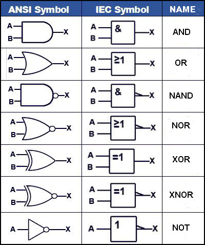
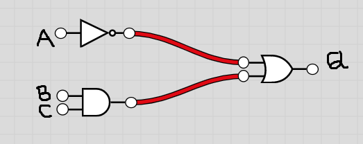
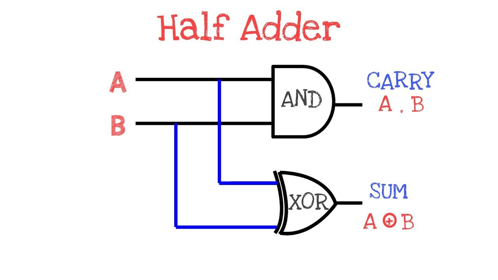
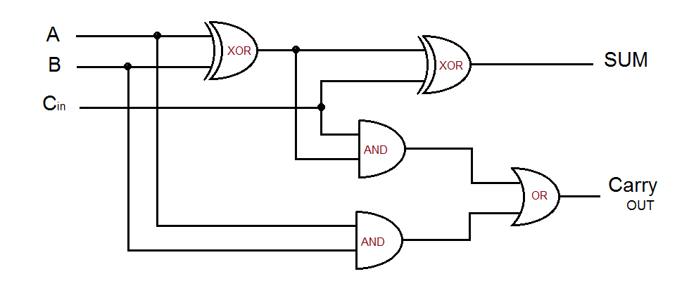

# What are logic gates? 
* Logic gates are electronic switches implemented with transistors whch apply logical operations to one or more Boolean (TRUE or FALSE) inputs in order to produce a single Boolean output.

## What are logic circuits?
* Logic gates are combined to form logic circuits which can perform more complex operations

## Symbols
 * When looking at logic gates and logic circuits there are many ways of representing **TRUE**:
    * TRUE
    * 1
    * HIGH
    * ON

* and **FALSE**:
    * FALSE
    * 0 
    * LOW
    * OFF

## Logic gate Symbols
In a circuit schematic each logic gate is represented by a different picture, like the ones shown below.

# Truth Tables
A truth table shows every possible combination of inputs and the corresponding output for a logic gate or logic circuit.

* In a truth table, 1 represents TRUE and 0 represents FALSE.

# NOT GATE
The NOT gate (inverter) has one input and one output. The gate's output is always the opposite of its input. For example, if the input to the gate is a 1, it will output 0.

## NOT GATE TRUTH TABLE
* The truth table for the not gate has just two columns, the input A and the output Q. There are just two possible inputs, 0 and 1.

| A | Q | Reasoning                                        |
|---|---|--------------------------------------------------|
| 0 | 1 | If the input is FALSE, the opposite must be TRUE |
| 1 | 0 | If the input is TRUE, the opposite must be FALSE |

In Boolean logic, an **overline** signifies that the values(s) below have the **NOT** operation applied to them.

# AND GATE
the AND gate has two inputs,labelle A and B in the truth table below, and ouputs the two inputs multiplied together

| A | B | Q |
|---|---|---|
| 0 | 0 | 0 |
| 0 | 1 | 0 |
| 1 | 0 | 0 |
| 1 | 1 | 1 |

$Q = A * B$ / $Q = A*B$ / $Q = AB$
        
# OR GATE
The OR GATE outputs the inputs added together.

| A | B | Q |
|---|---|---|
| 0 | 0 | 0 |
| 0 | 1 | 1 |
| 1 | 0 | 1 |
| 1 | 1 | 1 |

$Q = A + B$

# **NOTE**

* When we peak fo MULTIPLICATION and ADDITION with AND and OR gates, we do not mean BINARY multiplication and addition. 
* It means boolean multiplication and boolean addition from boolean algebra.
* For boolean multiplication, we could evaluate each row in teh truth tale as 'A is true **AND** B is true'.

For Boolean addition, we could evaluate each row in the truth table as 'A is true **OR** B is true'

# XOR GATE
* Only A or B are true.

| A | B | Q |
|---|---|---|
| 0 | 0 | 0 |
| 0 | 1 | 1 |
| 1 | 0 | 1 |
| 1 | 1 | 0 |

# NAND GATE
* NOT gate and AND gate combined.

| A | B | Q |
|---|---|---|
| 0 | 0 | 1 |
| 0 | 1 | 1 |
| 1 | 0 | 1 |
| 1 | 1 | 0 |

# NOR GATE
* The NOT OR (NOR) gate is a combination of the NOT gate and the OR gate.

| A | B | Q |
|---|---|---|
| 0 | 0 | 1 |
| 0 | 1 | 0 |
| 1 | 0 | 0 |
| 1 | 1 | 0 |

$Q = Ā + B$

* The NOR gate's truth table is  the same as the OR gate's truth table, but the output is reversed.

# XNOR GATE
* The XNOR (Exclusive NOR) gate is a combination of the NOT gate and the XOR gate.

| A | B | Q |
|---|---|---|
| 0 | 0 | 1 |
| 0 | 1 | 0 |
| 1 | 0 | 0 |
| 1 | 1 | 1 |

* The XNOR gate's truth table is the same as the XOR gate's truth table, but the output is reversed.

# Logical Circuits
Logic gates can be combined to form more complex ciircuits.

The circuits above combines three logic gates and can be represented using the logical expression below:

$Q =(B*C) + Ā$

In order to create a truth table for this circuit, we first need to fill in all the possible permutations.

| A | B | C | B AND C | Ā | Q |
|---|---|---|-----|---|---|
| 0 | 0 | 0 | 0   | 1 | 1 |
| 0 | 0 | 1 | 0   | 1 | 1 |
| 0 | 1 | 0 | 0   | 1 | 1 |
| 0 | 1 | 1 | 1   | 1 | 1 |
| 1 | 0 | 0 | 0   | 0 | 0 |
| 1 | 0 | 1 | 0   | 0 | 0 |
| 1 | 1 | 0 | 0   | 0 | 0 |
| 1 | 1 | 1 | 1   | 0 | 1 |

# Logic Adders

An adder is a logic circuit that can be used to add Boolean values together. 

By combining the logic gates in a certain pattern we can create circuits to perform binary addition.

# Half Adder

A half adder is a logic circuit with two inputs, two outputs and two logic gates. The circuit can be used to add two Boolean values.

The two inputs are labelled A and B and the outputs are labelled S and C. Short for sum and carry.

The circuit is designed such that the output from the circuit gives the same output as you would obtain from adding two single digit binary numbers.

| A | B | s | c |
|---|---|---|---|
| 0 | 0 | 0 | 0 |
| 0 | 1 | 1 | 0 |
| 1 | 0 | 1 | 0 |
| 1 | 1 | 0 | 1 |

$0 + 0 = 0$ carry $ 0$

$0 + 1 = 1$ carry $ 0$

$1 + 0 = 1$ carry $ 0$

$1 + 1 = 0$ carry $ 1$

# Full Adder

A full adder has three inputs and two outputs.

A full adder is two half-adders plus an OR gate